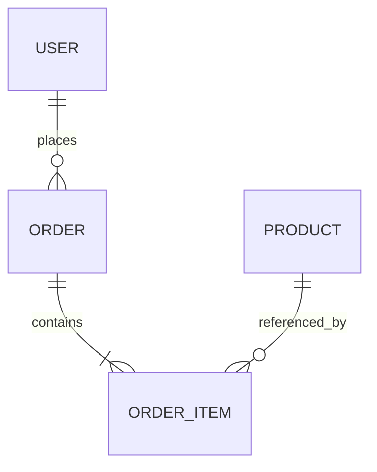

# データモデル

> テーブル定義の一次情報。設計判断やその根拠は `design.md` を参照。
> 読み手はこのシステムを既に知る熟練エンジニア。冗長な前置きは書かない。

## 1. 全体像 (ER図)

## 2. テーブル一覧

### {table_name}

- **役割**: このテーブルが表現する対象を 1〜2 文で。

**スキーマ**:

| カラム | 型 | 制約 | 意味 |
|--------|-----|------|------|
| id | uuid | PK | ... |
| ... | ... | ... | ... |

**インデックス / 整合性制約**（必要な場合のみ）:

- `idx_...`: ... を想定
- FK: `...` → `...`

---

### {another_table}

- **役割**: ...

**スキーマ**:

| カラム | 型 | 制約 | 意味 |
|--------|-----|------|------|
| ... | ... | ... | ... |
