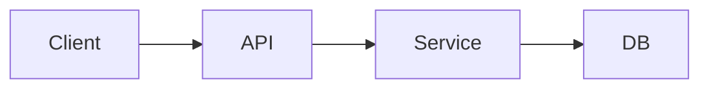

# 設計書: {TITLE}

> このドキュメントは、要求仕様から導き出されたソフトウェア設計を記述する。
> 読み手は実装担当者・レビュアー・ステークホルダーを想定する。

## 1. 目的とスコープ

- **この設計が解く課題**: ...
- **対象範囲**: ...
- **対象外**: ...

## 2. 前提と制約

- 技術的前提（言語、フレームワーク、既存システム）
- 運用的制約（チーム規模、リリース頻度、SLA）
- その他の暗黙の前提を明示化

## 3. アーキテクチャ概観

システム全体の構成を 1 枚の図で示す。Mermaid 推奨。

- **主要コンポーネントと責務**: 表形式で列挙
- **主要な通信経路**: 同期/非同期、プロトコル

## 4. モジュール構成

| モジュール | 責務 | 主な依存 | 所有するデータ |
|-----------|------|---------|---------------|
| ... | ... | ... | ... |

## 5. データモデル

テーブル定義と ER 図は [`data-model.md`](./data-model.md) に分離している。`design.md` には**モデル採用の設計判断**のみを残し、スキーマ自体は `data-model.md` を一次情報とする。

- **主要エンティティ**: {エンティティ名の列挙と、それぞれが担う責務を 1〜2 文で}
- **正規化 / 非正規化の方針**: {採用した方針と却下した代替案、却下理由}
- **集約境界とトランザクション境界**: {どこが 1 トランザクションか}

## 6. 主要な設計判断

各判断について **なぜそう決めたか** を 2〜4 文で。

- **D-001**: ...
- **D-002**: ...

## 7. 非機能要件への対応

| 観点 | 要求 | 対応策 |
|------|------|--------|
| 性能 | ... | ... |
| 可用性 | ... | ... |
| セキュリティ | ... | ... |

## 8. 関連ドキュメント

- [データモデル（ER図・テーブル定義）](./data-model.md)
- [要求仕様と設計の対応表](./requirements-mapping.md)
- [ユースケースごとのデータ構造](./usecases.md)
- [残タスク・議論ポイント](./open-issues.md)
- [議事録](./minutes.md)
- [改訂履歴](./revision-history.md)
