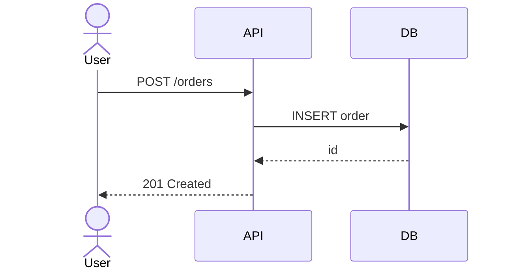
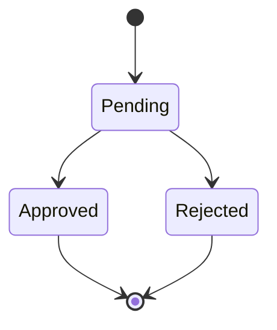

# ユースケースごとのデータ構造

> 各ユースケースについて、入力・中間状態・出力のデータ構造と状態遷移を記述する。
> 目的は「設計が要求の動的振る舞いを支えられるか」を具体で検証すること。

## UC-XXX: {ユースケース名}

### 概要

- **アクター**: ...
- **事前条件**: ...
- **事後条件**: ...
- **関連要求**: R-001, R-003

### 主シナリオ

1. アクターが X を送信
2. システムが Y を検証
3. ...

### データフロー



### 入出力データ構造

**入力**:
```json
{
  "field": "..."
}
```

**中間状態** (必要に応じて):
- ステップ 2 時点で保持される値 / DB 上のレコード

**出力**:
```json
{
  "id": "...",
  "status": "..."
}
```

### 状態遷移（該当する場合）



### 代替/例外シナリオ

| 分岐条件 | 振る舞い | 影響を受けるデータ |
|---------|---------|-------------------|
| 在庫不足 | 409 を返し order は作成しない | ― |
| 並行更新 | 楽観ロックで 1 件のみ成功 | `orders.version` |

### 未決事項

- ...（ある場合は open-issues.md にリンク）
